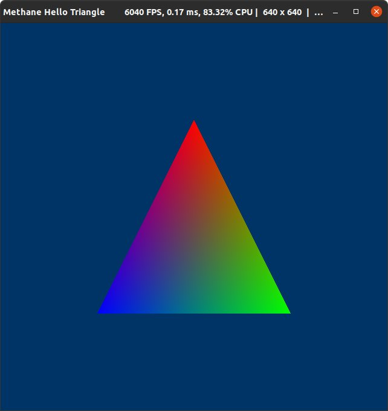
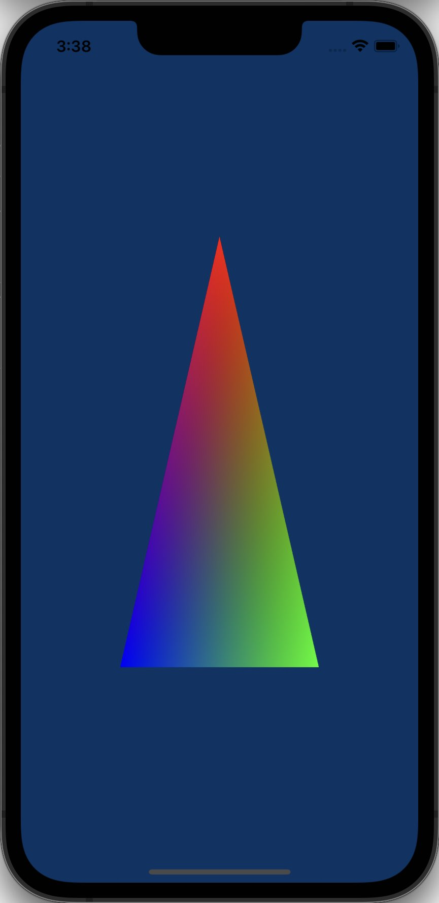

# Hello Triangle Tutorial

| <pre><b>Windows (DirectX 12)       </pre></b>                           | <pre><b>Linux (Vulkan)             </pre></b>                      | <pre><b>MacOS (Metal)              </pre></b>                     | <pre><b>iOS (Metal)</pre></b>                                   |
|-------------------------------------------------------------------------|--------------------------------------------------------------------|-------------------------------------------------------------------|-----------------------------------------------------------------|
|  |  |  |  | 

This tutorial demonstrates how to render a colored triangle in just 130 lines of code using Methane Kit:
- [HelloTriangleApp.cpp](HelloTriangleApp.cpp)
- [Shaders/HelloTriangle.hlsl](Shaders/HelloTriangle.hlsl)

The tutorial covers the following Methane Kit features and techniques:
- Using the base graphics application class for deferred frame rendering with triple buffering.
- Loading shaders, creating programs, and setting render states.
- Using render command lists to encode draw commands.
- Executing command lists on the GPU and presenting frame buffers on the screen.
- Configuring cross-platform application builds with shaders compiled into embedded resources.

## Application Controls

Common keyboard controls are enabled by the `Platform` and `Graphics` application controllers:
- [Methane::Platform::AppController](/Modules/Platform/App/README.md#platform-application-controller)
- [Methane::Graphics::AppController, AppContextController](/Modules/Graphics/App/README.md#graphics-application-controllers)

## Application and Frame Class Definitions

The `HelloTriangleApp` application class is derived from the base template class [Graphics::App<HelloTriangleFrame>](/Modules/Graphics/App),
which implements the base platform and graphics application infrastructure with support for deferred frame rendering.

The `HelloTriangleFrame` class is derived from the base class `Graphics::AppFrame` and extends it with a render command list
`render_cmd_list_ptr` and a command list set `execute_cmd_list_set_ptr` submitted for rendering to the frame buffer `index`.
The application is initialized with default settings using the `Graphics::AppSettings` structure, which is initialized
with the helper function `Tutorials::GetGraphicsTutorialAppSettings(...)`. The destruction of the application and its
resources is delayed until all rendering is completed on the GPU.

```cpp
#include <Methane/Kit.h>
#include <Methane/Graphics/App.hpp>
#include <Methane/Tutorials/AppSettings.h>

using namespace Methane;
using namespace Methane::Graphics;

struct HelloTriangleFrame final : AppFrame
{
    Rhi::RenderCommandList render_cmd_list;
    Rhi::CommandListSet    execute_cmd_list_set;
    using AppFrame::AppFrame;
};

using GraphicsApp = Graphics::App<HelloTriangleFrame>;
class HelloTriangleApp final : public GraphicsApp
{
private:
    Rhi::RenderState m_render_state;

public:
    HelloTriangleApp()
        : GraphicsApp(
            []() {
                Graphics::CombinedAppSettings settings = Tutorials::GetGraphicsTutorialAppSettings("Methane Hello Triangle", Tutorials::AppOptions::GetDefaultWithColorOnly());
                settings.graphics_app.SetScreenPassAccess({});
                return settings;
            }(),
            "Tutorial demonstrating colored triangle rendering with Methane Kit.")
    { }

    ~HelloTriangleApp() override
    {
        WaitForRenderComplete();
    }

    ...
};
```

## Graphics Resources Initialization

The `HelloTriangleApp` class keeps frame-independent resources in private class members. In this tutorial, it is only
the render state `m_render_state`, which is initialized in the `HelloTriangleApp::Init` method. The render state is
created with the `GetRenderContext().CreateRenderState(...)` factory method of the render context, which encapsulates
the program created inline with `GetRenderContext().CreateProgram(...)`. The program is created with a set of vertex and
pixel shaders described by the `Rhi::Program::ShaderSet` structure, which takes `Data::IProvider` and `IShader::EntryPoint`
structures consisting of file and function names. Compiled shader data is embedded in executable resources and accessed
via the shader data provider singleton available with `Data::ShaderProvider::Get()`. The program also defines the input
buffer layout using argument semantic names from HLSL shaders. Methane graphics abstraction uses shader reflection to
automatically identify argument types and offset sizes to build the underlying DirectX, Metal, or Vulkan layout description.
Render target color formats `GetScreenRenderPattern().GetAttachmentFormats()` are also required for program creation.
These formats are taken from the `Rhi::RenderPattern` object provided by the base class `Graphics::App`, which describes
the general configuration of color, depth, and stencil attachments used for final drawing to the window on the screen.
`RenderState::Settings` requires an `Rhi::RenderPattern` object and also contains settings for rasterizer, depth, stencil,
and blending states, which are skipped with default values for simplicity in this tutorial.

Render command lists are created from the rendering command queue `cmd_queue` acquired from the render context
`GetRenderContext().GetRenderCommandKit().GetQueue()`. Command lists `frame.render_cmd_list` are created for each frame
using the `cmd_queue.CreateRenderCommandList(frame.screen_pass)` factory method of the `Rhi::CommandQueue`, taking
`Rhi::RenderPass` as an argument. The created command list can be used for rendering only to that particular render pass.
Command lists are executed as part of command list sets `Rhi::CommandListSet`, which include only one command list in
this example and are also created for each frame `frame.execute_cmd_list_set`.

Finally, at the end of the `Init()` function, `GraphicsApp::CompleteInitialization()` is called to complete graphics
resources initialization and prepare for rendering.


```cpp
class HelloTriangleApp final : public GraphicsApp
{
private:
    Rhi::RenderState m_render_state;
    
public:
    ...

    void Init() override
    {
        GraphicsApp::Init();

        m_render_state = GetRenderContext().CreateRenderState(
            Rhi::RenderState::Settings
            {
                .program = GetRenderContext().CreateProgram(
                    Rhi::Program::Settings
                    {
                        .shader_set = Rhi::Program::ShaderSet
                        {
                            { Rhi::ShaderType::Vertex, { Data::ShaderProvider::Get(), { "HelloTriangle", "TriangleVS" } } },
                            { Rhi::ShaderType::Pixel,  { Data::ShaderProvider::Get(), { "HelloTriangle", "TrianglePS" } } },
                        },
                        .attachment_formats = GetScreenRenderPattern().GetAttachmentFormats()
                    }
                ),
                .render_pattern = GetScreenRenderPattern()
            }
        );
        m_render_state.SetName("Triangle Render State");

        const Rhi::CommandQueue& cmd_queue = GetRenderContext().GetRenderCommandKit().GetQueue();
        for (HelloTriangleFrame& frame : GetFrames())
        {
            frame.render_cmd_list = cmd_queue.CreateRenderCommandList(frame.screen_pass);
            frame.render_cmd_list.SetName(fmt::format("Render Triangle {}", frame.index));
            frame.execute_cmd_list_set = Rhi::CommandListSet({ frame.render_cmd_list.GetInterface() }, frame.index);
        }

        GraphicsApp::CompleteInitialization();
    }

    ...
};
```

## Frame Rendering Cycle

Rendering is implemented in the overridden `HelloTriangleApp::Render` method. Base graphics application rendering is executed
first with `GraphicsApp::Render()`, and rendering continues only when it succeeds. It waits for the previous iteration of the
rendering cycle to complete and for the availability of all frame resources. Then, current frame resources are requested with
`GraphicsApp::GetCurrentFrame()` and used for render commands encoding.

To begin encoding, the command list has to be reset with the render state using the `Rhi::RenderCommandList::Reset(...)` method.
The default view state is set with a full frame viewport and scissor rect using the `Rhi::RenderCommandList::SetViewState(...)`
method. Drawing of 3 vertices is submitted as the `Rhi::RenderPrimitive::Triangle` primitive using the
`Rhi::RenderCommandList::Draw(...)` call. Vertex buffers are not used for simplification, so the vertex shader will receive only
`vertex_id` and will need to provide vertex coordinates based on that. Finally, the `ICommandList::Commit` method is called to
complete render commands encoding.

Execution of GPU rendering is started with the `ICommandQueue::Execute(...)` method called on the same command queue which was
used to create the command list submitted for execution. The frame buffer with the result image is presented by the swap-chain
with the `RenderContext::Present()` method call.

```cpp
class HelloTriangleApp final : public GraphicsApp
{
    ...

    bool Render() override
    {
        if (!GraphicsApp::Render())
            return false;

        const HelloTriangleFrame& frame = GetCurrentFrame();
        frame.render_cmd_list.ResetWithState(m_render_state);
        frame.render_cmd_list.SetViewState(GetViewState());
        frame.render_cmd_list.Draw(Rhi::RenderPrimitive::Triangle, 3);
        frame.render_cmd_list.Commit();

        GetRenderContext().GetRenderCommandKit().GetQueue().Execute(frame.execute_cmd_list_set);
        GetRenderContext().Present();

        return true;
    }
};
```

Graphics render loop is started from `main(...)` entry function using `GraphicsApp::Run(...)` method which is
also parsing command line arguments.

```cpp
int main(int argc, const char* argv[])
{
    return HelloTriangleApp().Run({ argc, argv });
}
```

## Colored Triangle Shaders

This tutorial uses simple HLSL shader [Shaders/Triangle.hlsl](Shaders/Triangle.hlsl) which is taking vertex positions
and colors from inline constant arrays based on `vertex_id` argument passed to vertex shader. 

```cpp
struct PSInput
{
    float4 position : SV_POSITION;
    float4 color    : COLOR;
};

PSInput TriangleVS(uint vertex_id : SV_VertexID)
{
    const float4 positions[3] = {
        {  0.0F,  0.5F, 0.0F, 1.F },
        {  0.5F, -0.5F, 0.0F, 1.F },
        { -0.5F, -0.5F, 0.0F, 1.F },
    };

    const float4 colors[3] = {
        { 1.0F, 0.0F, 0.0F, 1.F },
        { 0.0F, 1.0F, 0.0F, 1.F },
        { 0.0F, 0.0F, 1.0F, 1.F },
    };

    PSInput output;
    output.position = positions[vertex_id];
    output.color    = colors[vertex_id];
    return output;
}

float4 TrianglePS(PSInput input) : SV_TARGET
{
    return input.color;
}
```

## CMake Build Configuration

Finally, CMake build configuration [CMakeLists.txt](CMakeLists.txt) of the application
is powered by the included Methane CMake modules:
- [MethaneApplications.cmake](/CMake/MethaneApplications.cmake) - defines function `add_methane_application`
- [MethaneShaders.cmake](/CMake/MethaneShaders.cmake) - defines functions `add_methane_shaders_source` and `add_methane_shaders_library`
- [MethaneResources.cmake](/CMake/MethaneResources.cmake) - defines functions `add_methane_embedded_textures` and `add_methane_copy_textures`

```cmake
include(MethaneApplications)
include(MethaneShaders)

set(TARGET MethaneHelloTriangle)

add_methane_application(
    TARGET ${TARGET}
    NAME "Methane Hello Triangle"
    DESCRIPTION "Tutorial demonstrating colored triangle rendering with Methane Kit."
    INSTALL_DIR "Apps"
    SOURCES
    HelloTriangleApp.cpp
)

add_methane_shaders_source(
    TARGET ${TARGET}
    SOURCE Shaders/HelloTriangle.hlsl
    VERSION 6_0
    TYPES
    vert=TriangleVS
    frag=TrianglePS
)

add_methane_shaders_library(${TARGET})

target_link_libraries(${TARGET}
    PRIVATE
    MethaneAppsCommon
)
```

Each shader source file is added to build target with `add_methane_shaders_source` function which may contain several
shaders. Every usable shader entry point is described in TYPES parameter in form of `{shader_type}={entry_function}[:{macro_definitions}]`.
After all shader sources are added to build target, `add_methane_shaders_library` function is called to pack compiled shader
binaries to resource library and link it to the given build target. This makes all compiled shaders available in 
C++ code of target using `Data::ShaderProvider` singleton class.

Now you have all in one application executable/bundle running on Windows & MacOS, which is rendering colored triangle in window with support of resizing the frame buffer.

## Continue learning

Continue learning Methane Graphics programming in the next tutorial [Hello Cube](../02-HelloCube), 
which is demonstrating cube mesh drawing using vertex and index buffers with camera projection applied on CPU.
