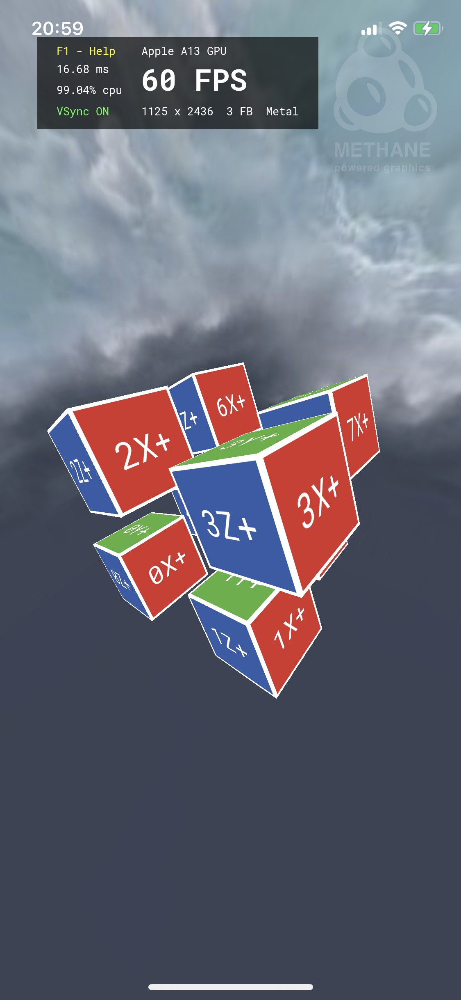

# Cube Map Array Tutorial

| <pre><b>Windows (DirectX 12)       </pre></b>                        | <pre><b>Linux (Vulkan)             </pre></b>                   | <pre><b>MacOS (Metal)              </pre></b>                  | <pre><b>iOS (Metal)</pre></b>                                                       |
|----------------------------------------------------------------------|-----------------------------------------------------------------|----------------------------------------------------------------|-------------------------------------------------------------------------------------|
|  |  |  |  * No simulator support |

This tutorial demonstrates cube-map array texturing and sky-box rendering with Methane Kit:
  - [CubeMapArrayApp.h](CubeMapArrayApp.h)
  - [CubeMapArrayApp.cpp](CubeMapArrayApp.cpp)
  - [Shaders/CubeMapArray.hlsl](Shaders/CubeMapArray.hlsl)
  - [Shaders/CubeMapArrayUniforms.h](Shaders/CubeMapArrayUniforms.h)

Tutorial demonstrates the following techniques:
  - Loading face images to cube map texture and using it for sky-box rendering in background;
  - Creating cube-map array render target texture;
  - Rendering text labels to the faces of cube-map array texture via separate render passes 
    using helper class [TextureLabeler](/Apps/Common/Include/TextureLabeler.h);
  - Instanced rendering of multiple cubes displaying all faces of the pre-rendered cube-map array texture;
  - Using Sky-box rendering extension with panoramic cube-map texture loaded from image files.

## Application Controls

Common keyboard controls are enabled by the `Platform`, `Graphics` and `UserInterface` application controllers:
- [Methane::Platform::AppController](/Modules/Platform/App/README.md#platform-application-controller)
- [Methane::Graphics::AppController, AppContextController](/Modules/Graphics/App/README.md#graphics-application-controllers)
- [Methane::UserInterface::AppController](/Modules/UserInterface/App/README.md#user-interface-application-controllers)

## Cube-Map Texture Initialization

Cube-map texture is created using settings generated with `rhi::ITexture::Settings::ForCubeImage(...)`
amd is set the `TexturedMeshBuffers` instance with `m_cube_buffers_ptr->SetTexture(...)`. Then this texture
is bound to Pixel shader argument `g_texture_array` in `frame.cube.program_bindings` initialization.

Content of the texture is rendered to its faces using `TextureLabeler` class, which is rendering face identification
text labels to the texture faces. Rendering is done after `UserInterfaceApp::CompleteInitialization()` call,
to be sure that all necessary resources have been uploaded to the GPU.

```cpp
void CubeMapArrayApp::Init()
{
    ...
    
    // Create cube mesh buffer resources
    gfx::CubeMesh<CubeVertex> cube_mesh(CubeVertex::layout);
    m_cube_buffers_ptr = std::make_unique<TexturedMeshBuffers>(render_cmd_queue, std::move(cube_mesh), "Cube");

    // Create cube-map render target texture
    m_cube_buffers_ptr->SetTexture(
        rhi::Texture(
            GetRenderContext(),
            rhi::ITexture::Settings::ForCubeImage(
                g_cube_texture_size, CUBE_MAP_ARRAY_SIZE, gfx::PixelFormat::RGBA8Unorm, false,
                rhi::ResourceUsageMask({ rhi::ResourceUsage::RenderTarget, rhi::ResourceUsage::ShaderRead })
            )));
            
    ...
    
    // Create frame buffer resources
    for(CubeMapArrayFrame& frame : GetFrames())
    {
        // Configure program resource bindings
        frame.cube.program_bindings = m_render_state.GetProgram().CreateBindings({
            { { rhi::ShaderType::Pixel,  "g_texture_array" }, m_cube_buffers_ptr->GetTexture().GetResourceView() },
            { { rhi::ShaderType::Pixel,  "g_sampler"       }, m_texture_sampler.GetResourceView()                },
        }, frame.index);
        frame.cube.uniforms_argument_binding_ptr = &frame.cube.program_bindings.Get({ rhi::ShaderType::Vertex, "g_uniforms" });
        ...
    }
    
    // Create all resources for texture labels rendering before resources upload in UserInterfaceApp::CompleteInitialization()
    TextureLabeler cube_texture_labeler(GetUIContext(), GetFontContext(), m_cube_buffers_ptr->GetTexture(),
                                        rhi::ResourceState::Undefined, { g_cube_texture_size / 4U, 10U });

    // Upload all resources, including font texture and text mesh buffers required for rendering
    UserInterfaceApp::CompleteInitialization();
    
    // Encode and execute texture labels rendering commands when all resources are uploaded and ready on GPU
    cube_texture_labeler.Render();

    GetRenderContext().WaitForGpu(rhi::IContext::WaitFor::RenderComplete);
}
```

## Cube-Map Rendering

Rendering of the cube instances is done similarly to other tutorials, but with the use of `instance_count` parameter
in the `m_cube_buffers_ptr->Draw(..., CUBE_MAP_ARRAY_SIZE)` call. `instance_id` related to this count is passed in the
vertex shader and used to form texture coordinates for cube-map array texture sampling.

```cpp
bool CubeMapArrayApp::Render()
{
    ...
    
    META_DEBUG_GROUP_VAR(s_debug_group, "Cube Instances Rendering");
    frame.render_cmd_list.ResetWithState(m_render_state, &s_debug_group);
    frame.render_cmd_list.SetViewState(GetViewState());
    m_cube_buffers_ptr->Draw(frame.render_cmd_list, frame.cube.program_bindings, 0U, CUBE_MAP_ARRAY_SIZE);
    
    ...
}
```

## Cube-Map Array Shaders

### CubeMapArrayUniforms.h

Uniforms structure with array of MVP matrices for all cube instances:

```hlsl
```cpp
#define CUBE_MAP_ARRAY_SIZE 8 // NOSONAR

struct Uniforms
{
    float4x4 mvp_matrix_per_instance[CUBE_MAP_ARRAY_SIZE]; // NOSONAR
};
```

### CubeMapArray.hlsl

Vertex shader prepares texture coordinates `uvwi` for cube-map texture sampling by writing cube vertex position to `uvw`
texture coordinates and instance id to the `i` component, which is used as index in the texture array.
Sampling of cube-map array texture `g_texture_array` is done in the pixel shader from interpolated coordinates `uvwi`.

```hlsl

```cpp
#include "CubeMapArrayUniforms.h"

struct VSInput
{
    uint   instance_id : SV_InstanceID;
    float3 position    : POSITION;
};

struct PSInput
{
    float4 position : SV_POSITION;
    float4 uvwi     : UVFACE;
};

ConstantBuffer<Uniforms>  g_uniforms      : register(b0, META_ARG_FRAME_CONSTANT);
TextureCubeArray          g_texture_array : register(t0, META_ARG_CONSTANT);
SamplerState              g_sampler       : register(s0, META_ARG_CONSTANT);

PSInput CubeVS(VSInput input)
{
    PSInput output;
    output.position = mul(float4(input.position, 1.F), g_uniforms.mvp_matrix_per_instance[input.instance_id]);
    output.uvwi     = float4(-input.position, input.instance_id); // use position with negative sign to fix texture reflection
    return output;
}

float4 CubePS(PSInput input) : SV_TARGET
{
    return g_texture_array.Sample(g_sampler, input.uvwi);
}
```

## Continue learning

Continue learning Methane Graphics programming in the next tutorial [ParallelRendering](../07-ParallelRendering),
which is demonstrating multi-threaded rendering with `IParallelRenderCommandList`.