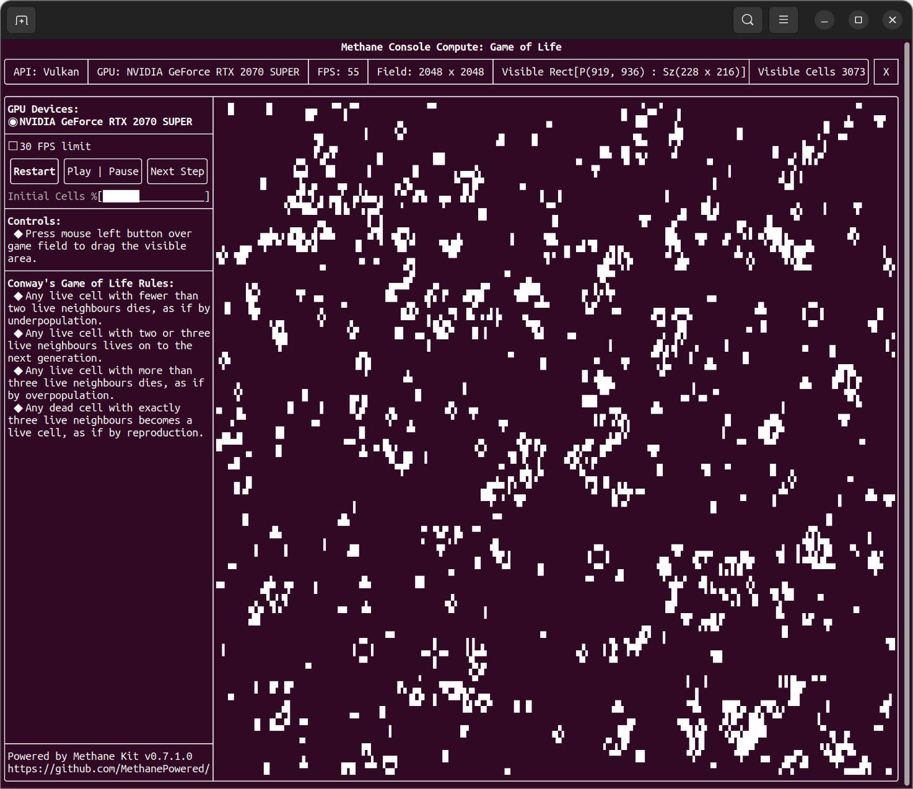
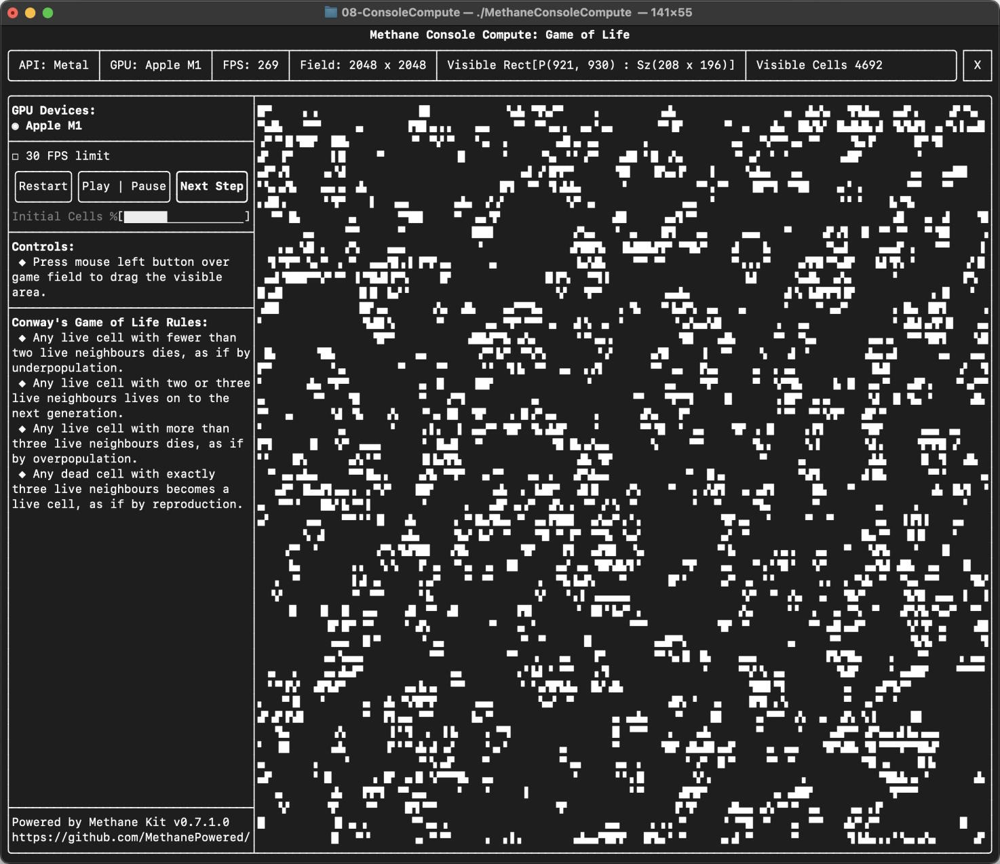

# Console Compute Tutorial

| <pre><b>Windows (DirectX 12)       </b></pre>                            | <pre><b>Linux (Vulkan)             </b></pre>                       | <pre><b>MacOS (Metal)              </b></pre>                      |
|--------------------------------------------------------------------------|---------------------------------------------------------------------|--------------------------------------------------------------------|
|  |  |  |

Tutorial implements [Conway's Game of Life](https://en.wikipedia.org/wiki/Conway%27s_Game_of_Life) 
in Compute shader running in pure Console application without graphics.
GPU Compute pipeline is programmed using Methane Kit and console UI is
implemented with amazing [FTXUI](https://github.com/ArthurSonzogni/FTXUI) library:
  - [ConsoleApp.h](ConsoleApp.h) - console application base class implementing console UI.
  - [ConsoleApp.cpp](ConsoleApp.cpp)
  - [ConsoleComputeApp.h](ConsoleComputeApp.h) - compute application implements Gave of Life logic using Methane Kit.
  - [ConsoleComputeApp.cpp](ConsoleComputeApp.cpp)
  - [Shaders/GameOfLife.hlsl](Shaders/GameOfLife.hlsl) - HLSL compute shader implements Game of Life cells update iteration.

Tutorial demonstrates the following techniques:
  - Using [ComputeContext](/Modules/Graphics/RHI/Impl/Include/Methane/Graphics/RHI/ComputeContext.h) for 
GPU-accelerated compute operations from console application without GUI Window.
  - Using [ComputeState](/Modules/Graphics/RHI/Impl/Include/Methane/Graphics/RHI/ComputeState.h) with compute program
for dispatching compute operations on GPU.
  - Using [ComputeCommandList](/Modules/Graphics/RHI/Impl/Include/Methane/Graphics/RHI/ComputeCommandList.h) for recording
commands for dispatching compute operation and executing it in the compute command queue.
  - Using 2D Texture both as Input and Output of compute program data (bound as UAV, Unordered Access View).
  - Transferring texture data both to GPU and from GPU for read-back on CPU for presenting results in console UI.
  - Using [FTXUI](https://github.com/ArthurSonzogni/FTXUI) library for creating GUI-like user interfaces in console.

## Game of Life Rules

The universe of the Game of Life is an infinite, two-dimensional orthogonal grid of square cells, 
each of which is in one of two possible states, live or dead (or populated and unpopulated, respectively).
Every cell interacts with its eight neighbours, which are the cells that are horizontally, vertically, or diagonally adjacent.
At each step in time, the following transitions occur:
  - Any live cell with fewer than two live neighbours dies, as if by underpopulation.
  - Any live cell with two or three live neighbours lives on to the next generation.
  - Any live cell with more than three live neighbours dies, as if by overpopulation.
  - Any dead cell with exactly three live neighbours becomes a live cell, as if by reproduction.

## Compute Initialization

GPU compute initialization using Methane Kit includes creating `ComputeContext`, `ComputeState` and `ComputeCommandList`.
Compute state duplicates compute [thread group size](https://learn.microsoft.com/en-us/windows/win32/direct3dhlsl/sm5-attributes-numthreads)
from [HLSL compute shader](#hlsl-compute-shader) due to API differences between DirectX, Vulkan
(define thread group size in shader) and Metal (defines thread group size in dispatch command arguments).

```cpp
void ConsoleComputeApp::Init()
{
    META_FUNCTION_TASK();
    const rhi::Device* device_ptr = GetComputeDevice();
    m_compute_context = device_ptr->CreateComputeContext(m_parallel_executor, {});
    m_compute_context.SetName("Game of Life");

    m_compute_state = m_compute_context.CreateComputeState({
            m_compute_context.CreateProgram({
                rhi::Program::ShaderSet { { rhi::ShaderType::Compute, { data::ShaderProvider::Get(), { "GameOfLife", "MainCS" } } } }
            }),
        rhi::ThreadGroupSize(16U, 16U, 1U)
    });
    m_compute_state.GetProgram().SetName("Game of Life Program");
    m_compute_state.SetName("Game of Life Compute State");
    
    m_compute_cmd_list = m_compute_context.GetComputeCommandKit().GetQueue().CreateComputeCommandList();
    m_compute_cmd_list.SetName("Game of Life Compute");
    m_compute_cmd_list_set = rhi::CommandListSet({ m_compute_cmd_list.GetInterface() });
    
    ...
}
```

Additionally, 2D Image Texture is created with `R8Uint` pixel format which is used for `ShaderRead`, `ShaderWrite` and `Readback`
of texture data after compute iteration. `ProgramBindings` instance is created for binding the texture to compute shader
argument `g_frame_texture` defined in [HLSL shader](#hlsl-compute-shader). Texture is initialized with random cells data
on CPU and uploaded to the GPU using transfer queue.

```cpp
void ConsoleComputeApp::Init()
{
    ...
    
    rhi::TextureSettings frame_texture_settings = rhi::TextureSettings::ForImage(
        gfx::Dimensions(GetFieldSize()),
        std::nullopt, gfx::PixelFormat::R8Uint, false,
        rhi::ResourceUsageMask{
            rhi::ResourceUsage::ShaderRead,
            rhi::ResourceUsage::ShaderWrite,
            rhi::ResourceUsage::ReadBack
        }
    );
    m_frame_texture = m_compute_context.CreateTexture(frame_texture_settings);
    m_frame_texture.SetName("Game of Life Frame Texture");

    m_compute_bindings = m_compute_state.GetProgram().CreateBindings({
        { { rhi::ShaderType::Compute, "g_frame_texture" }, { { m_frame_texture.GetInterface() } } },
    });
    m_compute_bindings.SetName("Game of Life Compute Bindings");

    RandomizeFrameData();

    // Complete bindings and texture initialization
    m_compute_context.CompleteInitialization();
}
```

## Compute Iteration

On each iteration compute commands are recorded in `ComputeCommandList`: dispatch command performs execution of 
compute shader from compute state. Then recorded command list is executed in compute command queue.
After compute execution is completed, frame texture data is read back on CPU for presenting in console UI.

```cpp
void ConsoleComputeApp::Compute()
{
    META_FUNCTION_TASK();
    const data::FrameSize&       field_size        = GetFieldSize();
    const rhi::CommandQueue&     compute_cmd_queue = m_compute_context.GetComputeCommandKit().GetQueue();
    const rhi::ThreadGroupSize&  thread_group_size = m_compute_state.GetSettings().thread_group_size;
    const rhi::ThreadGroupsCount thread_groups_count(data::DivCeil(field_size.GetWidth(), thread_group_size.GetWidth()),
                                                     data::DivCeil(field_size.GetHeight(), thread_group_size.GetHeight()),
                                                     1U);

    META_DEBUG_GROUP_VAR(s_debum_group, "Compute Frame");
    m_compute_cmd_list.ResetWithState(m_compute_state, &s_debum_group);
    m_compute_cmd_list.SetProgramBindings(m_compute_bindings);
    m_compute_cmd_list.Dispatch(thread_groups_count);
    m_compute_cmd_list.Commit();

    compute_cmd_queue.Execute(m_compute_cmd_list_set);
    m_compute_context.WaitForGpu(rhi::ContextWaitFor::ComputeComplete);
    m_frame_data = m_frame_texture.GetData(compute_cmd_queue);
    m_fps_counter.OnCpuFrameReadyToPresent();
}
```

## HLSL Compute Shader

Compute shader implements compute iteration of cells data in texture `g_frame_texture` (bound for read and write),
updated according to [Game of Life rules](#game-of-life-rules).

```hlsl
RWTexture2D<uint> g_frame_texture;

[numthreads(16, 16, 1)]
void MainCS(uint3 id : SV_DispatchThreadID)
{
    uint2 frame_texture_size;
    g_frame_texture.GetDimensions(frame_texture_size.x, frame_texture_size.y);
    if (id.x > frame_texture_size.x || id.y > frame_texture_size.y)
        return;

    // For a cell at id.xy compute number live neighbours,
    // which are 8 cells that are horizontally, vertically, or diagonally adjacent.
    uint alive_neighbors_count = 0;
    for (int x = -1; x <= 1; x++)
    {
        for (int y = -1; y <= 1; y++)
        {
            if (x == 0 && y == 0)
                continue;

            uint2 neighbor_pos = uint2(id.x + x, id.y + y);
            if (g_frame_texture[neighbor_pos.xy] > 0)
                alive_neighbors_count++;
        }
    }

    if (g_frame_texture[id.xy] > 0)
    {
        // Any live cell with two or three live neighbours survives.
        // All other live cells die in the next generation.
        g_frame_texture[id.xy] = (alive_neighbors_count == 2 || alive_neighbors_count == 3) ? 1 : 0;
    }
    else
    {
        // Any dead cell with three live neighbours becomes a live cell.
        // All other dead cells stay dead.
        g_frame_texture[id.xy] = (alive_neighbors_count == 3) ? 1 : 0;
    }
}
```
