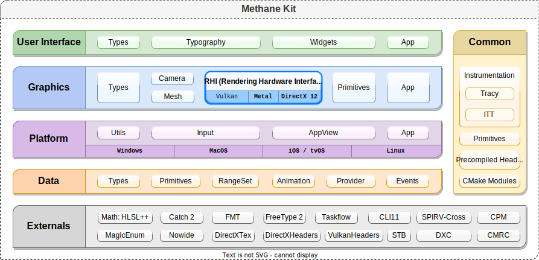

# Methane Kit Modules

## High-Level Architecture

Methane Kit architecture is clearly distributing library modules between 5 layers from low to high level of abstraction:
- [External](../Externals) external libraries and tools
- [Common](Common) libraries
- [Data](Data) processing libraries
- [Platform](Platform) abstraction libraries
- [Graphics](Graphics) API abstraction libraries
- [User Interface](UserInterface) libraries

## Modules Relations Diagram

Diagram generated with CMake using integrated GraphViz support shows detailed relations between CMake modules.

## Features

- **Cross-platform**
  - Supported platforms:
    - Windows 10 with DirectX 12 graphics API
    - MacOS 10.13 with Metal graphics API
    - Ubuntu Linux with Vulkan graphics API (builds, but graphics api is not supported yet)
  - Application infrastructure is GLFW free:
    - [Methane CMake modules](/CMake) implement toolchain for cross-platform graphics applications build configuration.
    - [AppBase](/Modules/Platform/App/Include/Methane/Platform/AppBase.h) base application class and [App](/Modules/Platform/App/Include/Methane/Platform/App.h) platform-specific implementations.
    - [Mouse](/Modules/Platform/Input/Include/Methane/Platform/Mouse.h) and [Keyboard](/Modules/Platform/Input/Include/Methane/Platform/Keyboard.h) input classes with platform abstractions of input states.
    - [Resources Provider](Modules/Data/Primitives/Include/Methane/Data/ResourceProvider.hpp) allows loading shaders and textures from embedded application resources.
    - [Animations](Modules/Data/Animation/Include/Methane/Data/Animation.h) execution infrastructure.
    - [Graphics application](/Modules/Graphics/App/Include/Methane/Graphics/App.hpp) base template class with graphics app implementation:
- **One shader code for all graphics APIs on all platforms**
  - Shaders are written in HLSL 6.x
  - Shaders are converted to native API shading language (Metal on MacOS) at build time with [DirectXShaderCompiler](https://github.com/microsoft/DirectXShaderCompiler) and [SPIRV-Cross](https://github.com/KhronosGroup/SPIRV-Cross) tools
  - Shaders are compiled at build time and embedded in application resources as bytecode (with all variations of preprocessor definitions configured by developer)
- **Easy to use object-oriented graphics API**
  - [Rendering Hardware Interface](/Modules/Graphics/RHI), abstraction API for native graphic APIs (DirectX 12, Vulkan and Metal).
  - [Graphics Extensions](/Modules/Graphics/Extensions) with graphics rendering primitives built on top of Methane RHI. 
  - [Common 3D graphics primities](/Modules/Graphics/Primitives) like FpsCounter, Camera, Mesh generators, etc.
- **User Interface** libraries:
  - UI application base class with integrated HUD, logo badge and help/parameters text panels
  - Typography library for fonts loading, rendering & text layout
  - Widgets library (under development)
- **Lightweight**: no heavy external dependencies, almost all external libraries are static or header only.
- **Performance oriented**:
  - Fast application startup, thanks to prebuilt shaders code.
  - [Deferred rendering](https://docs.microsoft.com/en-us/windows/win32/direct3d11/overviews-direct3d-11-render-multi-thread-render) approach with triple frame buffering by default.
  - Builtin API instrumentation with
    - [Tracy Realtime Frame Profiler](https://github.com/wolfpld/tracy)
    - [Intel ITT API](https://software.intel.com/en-us/vtune-amplifier-help-instrumentation-and-tracing-technology-apis) for performance analysis with [Intel Vtune Amplifier](https://software.intel.com/en-us/vtune) and [Intel Graphics Trace Analyzer](https://software.intel.com/en-us/gpa/graphics-trace-analyzer).
  
## Development Plans

- [x] Continuous integration system
- [x] Application user input with mouse and keyboard
- [x] Parallel command lists
- [x] Improved shaders toolset (use DXC & HLSL 6 instead of FXC, GLSLang & HLSL 5.1)
- [x] Text rendering
- [ ] Mesh loader
- [ ] Compute pipeline
- [ ] Vulkan API implementation
- [ ] Linux platform implementation
- [ ] Post-processing pipeline
- [ ] User-interface library
- [ ] Dynamic linking support